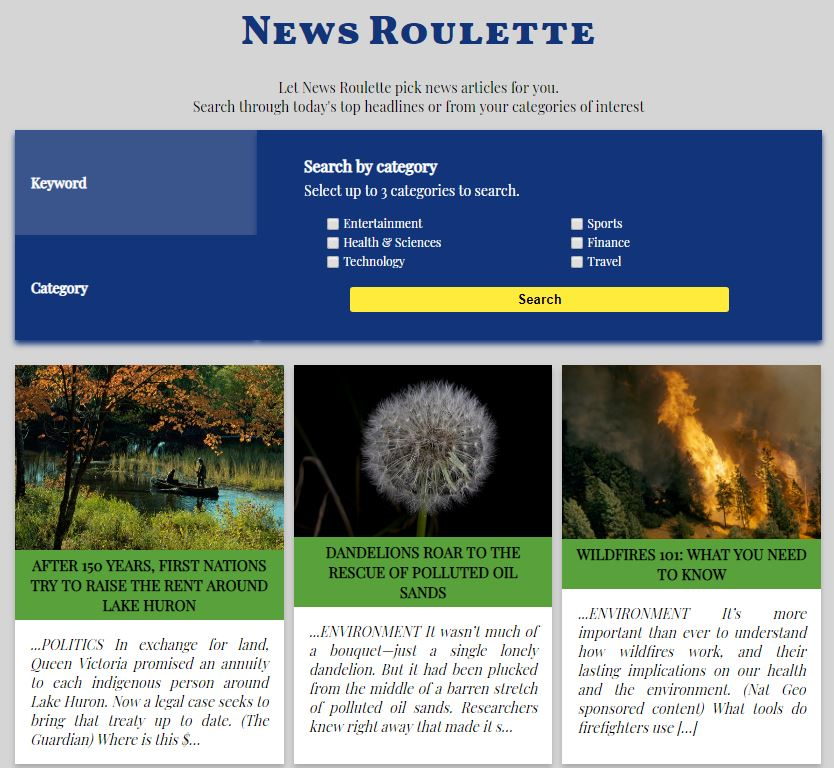

# News Roulette

**Table of Contents**

1. [Introduction](#introduction)
2. [How to Use](#how-to-use)
3. [Technologies Used](#technologies-used)

**Live Demo:** [News Roulette](https://staysee.github.io/news_roulette)

## Introduction

If you are in a hurry to catch up on some news but don't want to waste time looking for something to read, let News Roulette do the picking for you! Search today's top headlines by category or simply select one or a few categories you are interested in. Every search will return up to 6 randomized articles to read! Click on the cards to get to the articles.

## How to Use

Select your search by keyword or category.

* To search by keyword, enter your keyword(s) to search today's top headlines.
* To search by category, select your categories of interest to search through sources related to the selected categories.

Up to 6 articles chosen at random from the total results will be displayed.
Searching today's top headlines (keyword search) may produce zero results if the topic is not found in today's headlines.

Select an article card to read the article on a new tab.

## Technologies Used
News Roulette is build with News API, HTML, CSS, JavaScript, jQuery, GoogleFonts.
